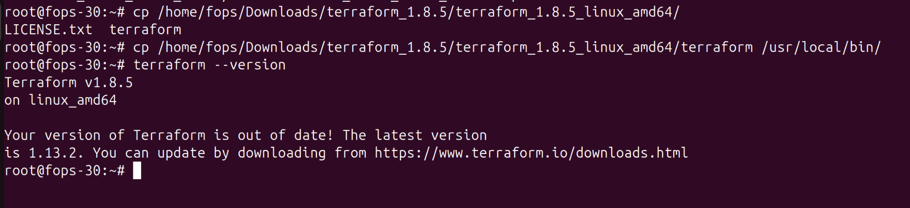
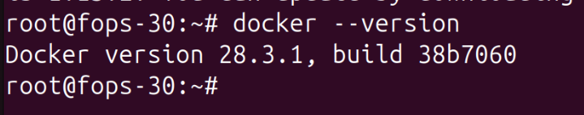
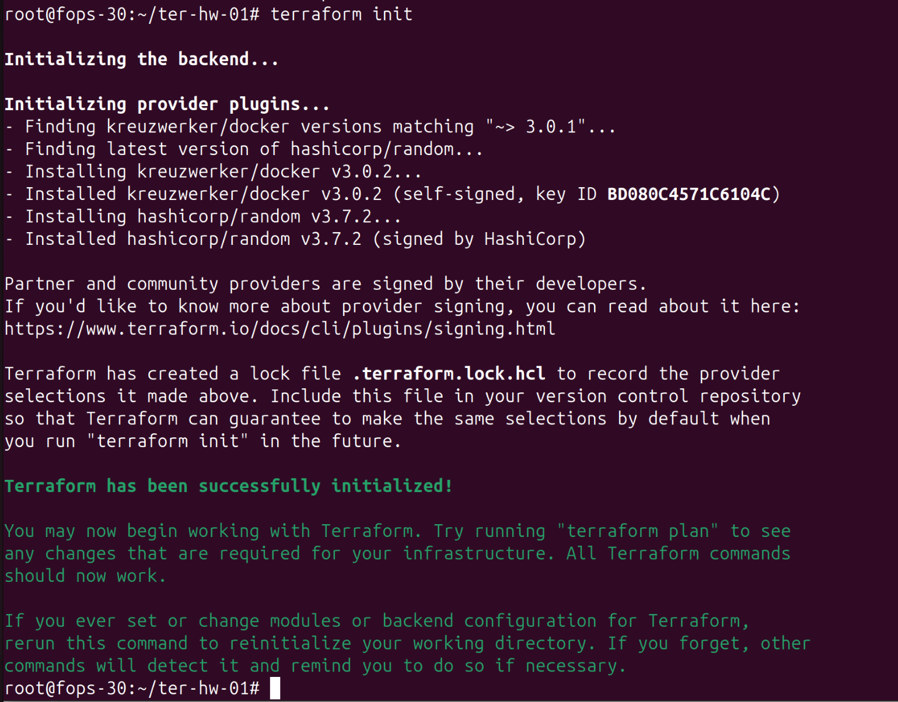
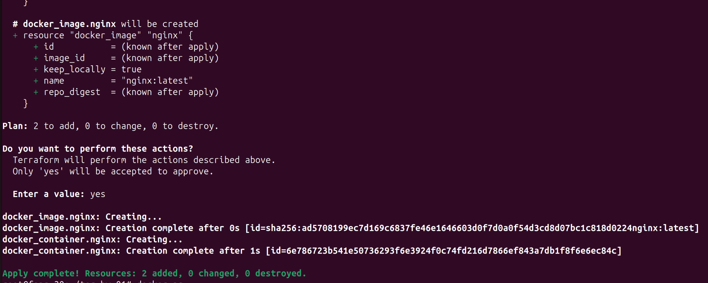
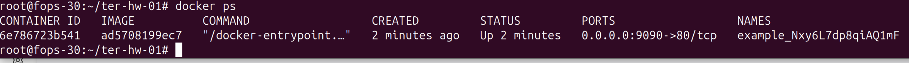
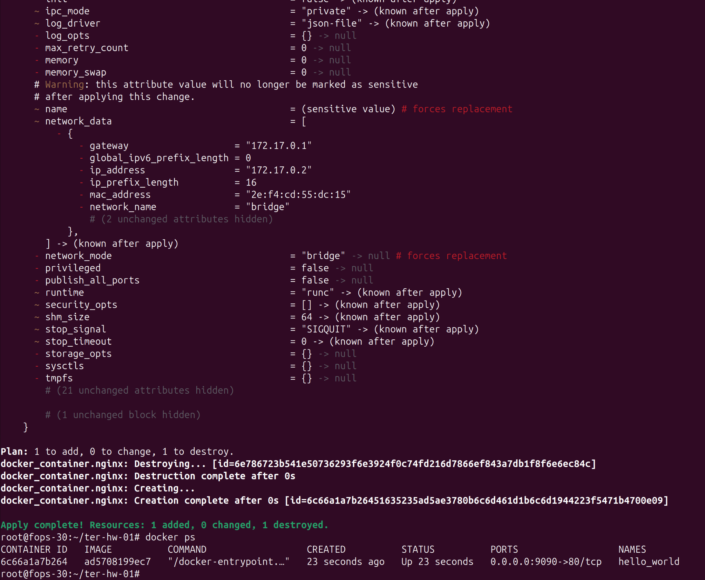
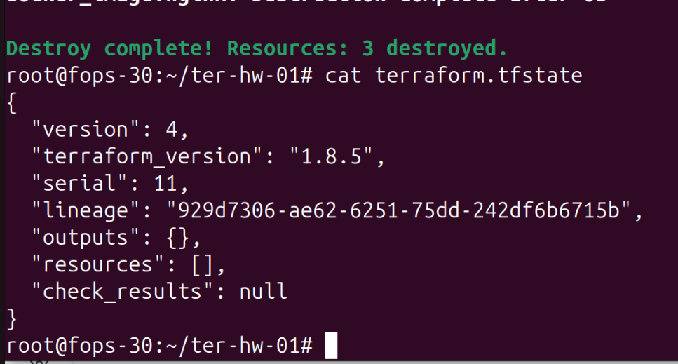

# Домашнее задание к занятию «Введение в Terraform»

## Цели задания
- Установить и настроить Terraform версии >= 1.8.4.  
- Научиться использовать готовый код с Docker-провайдером.  

---

## Проверка окружения

### Terraform установлен
```bash
terraform --version
Terraform v1.8.5
```


### Docker установлен
```bash
docker --version
Docker version 28.3.1, build 38b7060
```


---

## .gitignore
В проекте есть строка:
```gitignore
personal.auto.tfvars
```
Значит, **секретные данные** (пароли, токены) можно хранить в `personal.auto.tfvars`. Этот файл не попадёт в git.  

---

## Выполнение кода проекта

### Шаг 1. Инициализация
```bash
terraform init
```


---

### Шаг 2. Генерация пароля
В `terraform.tfstate` после `terraform apply` появилось содержимое ресурса `random_password`.  


---

### Шаг 3. Ошибки в коде и исправление

В исходном закомментированном блоке были ошибки:
- имя ресурса `docker_container "1nginx"` начиналось с цифры;
- ссылка на несуществующий ресурс `random_string_FAKE` и опечатка в `resulT`.

Исправленный фрагмент:
```hcl
resource "docker_image" "nginx" {
  name         = "nginx:latest"
  keep_locally = true
}

resource "docker_container" "nginx" {
  image = docker_image.nginx.image_id
  name  = "example_${random_password.random_string.result}"

  ports {
    internal = 80
    external = 9090
  }

  env = [
    "SECRET=${random_password.random_string.result}"
  ]
}
```

---

### Шаг 4. Проверка контейнера
```bash
terraform apply
docker ps
```



---

### Шаг 5. Имя контейнера = hello_world
Меняем блок на:
```hcl
name = "hello_world"
```

Применяем:
```bash
terraform apply -auto-approve
docker ps
```


---

### Шаг 6. Опасность `-auto-approve`
Флаг `-auto-approve` пропускает подтверждение плана.  
Опасность: можно случайно создать или удалить ресурсы без проверки.  
Польза: удобен для автоматизации (CI/CD).  

---

### Шаг 7. Уничтожение ресурсов
```bash
terraform destroy -auto-approve
```



---

### Шаг 8. Почему остался образ nginx:latest?
В ресурсе:
```hcl
keep_locally = true
```

Из документации провайдера Docker:  
> **keep_locally** — keep_locally (Boolean) If true, then the Docker image won't be deleted on destroy operation. If this is false, it will delete the image from the docker local storage on destroy operation..  

Источник:  
https://registry.terraform.io/providers/kreuzwerker/docker/latest/docs/resources/image#keep_locally

---

